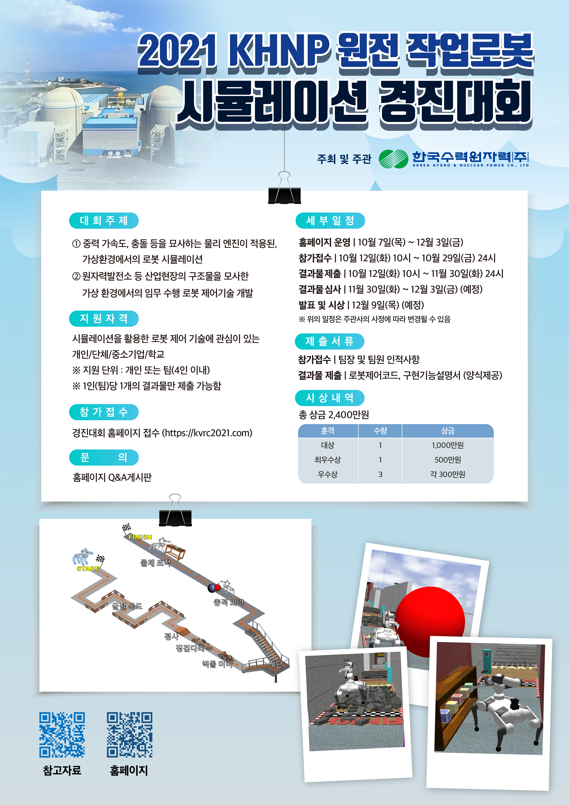

# Korea Hydro & Nuclear Power - Autonomous Robotic Challenge 2021
+ Quadruped robot with manipulator for this year
+ For gripping motion, [`robotiq_2finger_grippers`](https://github.com/Danfoa/robotiq_2finger_grippers) is used

<br>


## Homepage - [click](https://kvrc2021.com)


<br>

<p align="left">

</p>


<br>
<br>

### Please note that the world file is huge, so loading gazebo may take few minutes. (200 seconds for myself with super strong computer)

<br>

## ● Requirements
+ Mainly tested on `ROS Melodic` version
+ Make sure that you installed `ROS desktop full` version - refer the [wiki page](https://wiki.ros.org/ROS/Installation)
  + It comes with `Qt5`, `Gazebo`, `OpenCV` version 3.2, `cv_bridge`
  + In other words, this repo depends on `QT5`, `Gazebo`, `OpenCV`, `cv_bridge`.
+ Maker sure that you installed `ros-control` pacakges
~~~shell
$ sudo apt install ros-<YOUR_DISTRO>-ros-control ros-<YOUR_DISTRO>-ros-controllers
$ sudo apt install ros-<YOUR_DISTRO>-joy
~~~
+ Make sure that your `Cmake` version is more recent than 3.19
  + Check it with `$ cmake --version`
~~~shell
$ wget https://github.com/Kitware/CMake/releases/download/v3.19.8/cmake-3.19.8.tar.gz
$ tar zxf cmake-3.19.8.tar.gz && cd cmake-3.19.8
$ ./bootstrap
$ make
$ sudo make install

$ sudo reboot
$ cmake --version 
~~~
+ Make sure that your `Gazebo` version is at least `9.19.0`
  + Updating `Gazebo` - [reference link](http://gazebosim.org/tutorials?tut=install_ubuntu&cat=install#Alternativeinstallation:step-by-step)
~~~shell
$ sudo sh -c 'echo "deb http://packages.osrfoundation.org/gazebo/ubuntu-stable `lsb_release -cs` main" > /etc/apt/sources.list.d/gazebo-stable.list'
$ cat /etc/apt/sources.list.d/gazebo-stable.list
$ wget https://packages.osrfoundation.org/gazebo.key -O - | sudo apt-key add -
$ sudo apt-get update
$ sudo apt-get upgrade
~~~

---

<br>

## ● How to use

<br>

+ Clone the git
~~~shell
$ cd <your_workspace>/src
$ git clone --recursive https://github.com/engcang/khnp_competition2021
~~~

<br>

+ Add Gazebo Path
~~~shell
$ cd khnp_competition2021/gazebo_map_for_khnp
$ echo "export GAZEBO_MODEL_PATH=:$GAZEBO_MODEL_PATH:$(pwd)/refracted_corridor_map:$(pwd)/rough_terrain_map:$(pwd)/stair_map:$(pwd)/qr_codes:$(pwd)/manipulator_map:$(pwd)/disturbance_map:$(pwd)/common" >> ~/.bashrc
$ . ~/.bashrc
~~~

<br>

+ Build the package
~~~shell
$ cd <your_workspace_where_you_clone_this_repo>
$ catkin build
$ . devel/setup.bash
~~~

<br>

+ Run launch file
~~~shell
$ roslaunch khnp_competition main.launch
~~~

<br>


## ● What you can change
+ You can edit codes realted to control the robot. Currently, `champ` controller and temporal gripping controller is included in `main.launch` file.
+ In detail, you can edit any files under `pipebot_config/config` directory.
+ You can edit `hardwareInterface` of `transmission` in `pipebot.urdf` file to change the type of ROS controller.
  + Only from line 10 to line 245 of the .urdf file.
+ Add your autonomous navigation algorithm code and controller in `main.launch`.
  + Open `main.launch` to edit
```xml
<?xml version="1.0"?>
<launch>

<!-- Edit this part with your own algorithms -->


<!-- Do not touch below!!!!!!!! -->
  ............

</launch>
```
